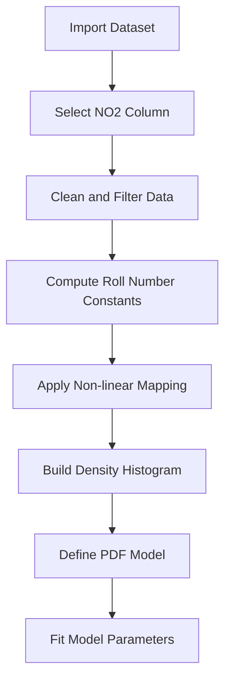

# Predictive_analysis_Assignment2_102317217
# Estimation of PDF Parameters from Transformed Air Quality Data

## Introduction

In this assignment, a statistical modeling approach is applied to air quality measurements collected across India. The task involves transforming raw Nitrogen Dioxide (NO₂) concentration values using a roll-number-dependent non-linear function and then estimating the parameters of a Gaussian-like probability density function based on the transformed data.

Each student obtains a unique transformation and result set through the use of their university roll number.

---

## Dataset Description

The analysis is performed using the NO₂ concentration values from the *India Air Quality Dataset* hosted on Kaggle.

- **Variable used:** NO₂ concentration  
- **Data source:** India Air Quality Data (Kaggle)  
- **Purpose:** Serve as the input feature for transformation and density estimation  

---

## Mathematical Formulation

### Non-Linear Transformation

**Constants Calculation:**
* $a_r = 0.05 \times (r \pmod 7)$
* $b_r = 0.3 \times ((r \pmod 5) + 1)$
*(where $r$ is your University Roll Number)*

This ensures that the transformation varies from student to student.

---

### Probability Density Function

After transformation, the distribution of \( z \) is modeled using the following PDF:

$$\hat{p}(z) = c \cdot e^{-\lambda(z-\mu)^2}$$
Where:

- \( c \) controls the scale of the distribution  
- \( \lambda \) determines the spread (precision)  
- \( \mu \) represents the central tendency  

---

## Parameter Estimation Strategy

- A probability density histogram is constructed from the transformed data.  
- A Gaussian-shaped function is fitted to the histogram.  
- The parameters \( c \), \( \lambda \), and \( \mu \) are learned using non-linear least squares optimization via `scipy.optimize.curve_fit`.

To ensure numerical stability and proper convergence, initial parameter values are chosen based on the empirical mean and peak density of the data.

---

## Data Processing Notes

- Encoding issues in the dataset are handled by explicitly specifying a compatible character encoding.  
- Non-numeric and missing values in the NO₂ column are removed before analysis.  
- Histogram normalization is applied so the fitted function represents a valid probability density.  

---

## Workflow Overview

## Final Results

The learned parameters obtained from the transformed dataset are:

- **Normalization constant (c):** 0.032110  
- **Precision parameter (λ):** 0.003545  
- **Location parameter (μ):** 19.876703  
- **Transformation constant (aᵣ):** 0.1000  
- **Transformation constant (bᵣ):** 0.9000  

These values are used directly for assignment submission.

---

## Software Requirements

- Python 3.12 or later  
- Pandas  
- NumPy  
- SciPy  

